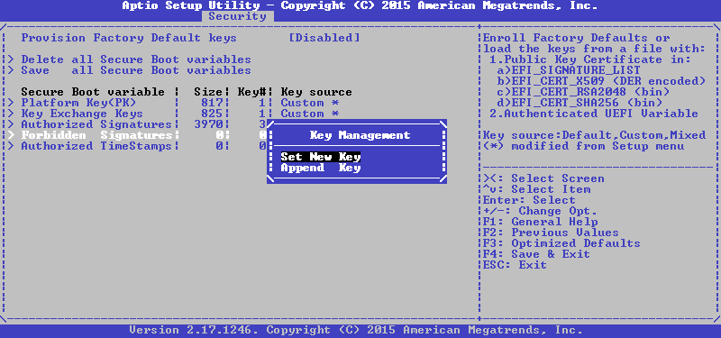
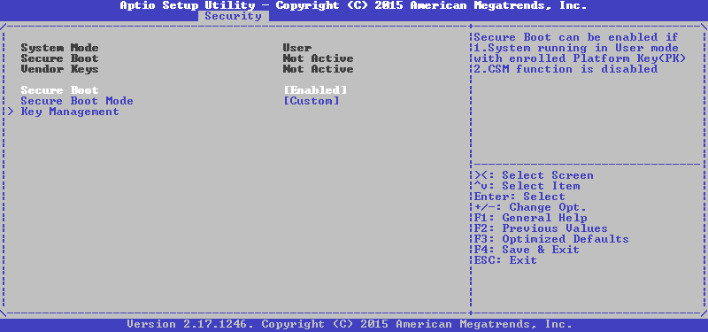

# UEFI Secure Boot

* Information based off of [CodeRush's Taming UEFI SecureBoot](https://habr.com/en/articles/273497/) and [ShimUtils README](https://github.com/acidanthera/OpenCorePkg/blob/master/Utilities/ShimUtils/README.md)

## What is Secure Boot

Secure Boot is a security feature that was introduced along with UEFI in 2011. Its main purpose is to prevent rootkits, as it verifies any binaries to ensure they're trusted and unmodified. OpenCore has full support for UEFI Secure Boot, and allows it to be used along with [vaulting](./vault.md) and [Apple Secure Boot](./applesecureboot.md)

To first know how Secure Boot exactly works, we have to take a look at how the boot process works with Secure Boot.

* PK (Platform Key) is used by the firmware to verify both itself and KEK
* KEK (Key Exchange Key) is used to verify and modify db and dbx
* db contains keys or hashes of approved EFI binaries
* dbx contains keys or hashes of forbidden binaries


We only need to worry about these parts of the diagram:

* KEK is verified by PK
* db is verified by KEK
* OpenCore.efi is verified by db
* OpenCore verifies everything else

The problem is that OpenCore.efi isn't signed by default, so normally under Secure Boot it will not run. However, if we sign OpenCore with our own key, and then enroll our keys into firmware, it will be able to run with Secure Boot enabled.

### Requirements

* A Linux environment
  * If you're on macOS, you can use Ubuntu multipass. If you're on Windows you can use WSL
* efitools
  * Required to sign keys, and to get KeyTool
* OpenSSL
  * Generate keys
* sbsigntool
  * Sign binaries

## Generating Keys

We need to generate three keys, those being PK, KEK, and ISK. ISK (Image Signing Key) is the key that we will use to sign the OpenCore binary. This key will be enrolled into db so that the firmware will allow OpenCore to run.

We'll generate our PK, KEK, and ISK

```sh
# Generate PK
openssl req -new -x509 -newkey rsa:2048 -sha256 -days 365 -subj "/CN=Platform Key" -keyout PK.key -out PK.pem
# Generate KEK
openssl req -new -x509 -newkey rsa:2048 -sha256 -days 365 -subj "/CN=Key Exchange Key" -keyout KEK.key -out KEK.pem
# Generate ISK
openssl req -new -x509 -newkey rsa:2048 -sha256 -days 365 -subj "/CN=Image Signing Key" -keyout ISK.key -out ISK.pem
```

You should be left with six files, with your PK, KEK, and ISK. These keys have an expiry date of 365 days, or 1 year. You can increase the number of days valid if necessary. We convert these keys from PEM format to ESL so that our EFI can understand it. Keep the PEM keys, since you'll need them for signing binaries.

```sh
# Convert PK
cert-to-efi-sig-list -g "$(uuidgen)" PK.pem PK.esl
# Convert KEK
cert-to-efi-sig-list -g "$(uuidgen)" KEK.pem KEK.esl
# Convert ISK
cert-to-efi-sig-list -g "$(uuidgen)" ISK.pem ISK.esl
```

## Adding Microsoft's Keys

If you have Windows installed, you may also (optionally) add Microsoft's keys into your db so that you can boot Windows. If you do not have Windows installed, or do not plan to boot Windows, you can skip to [signing the keys](#signing-keys).

We need two of Microsoft's keys:

* [Microsoft Windows Production CA 2011](http://go.microsoft.com/fwlink/?LinkID=321192)
  * Used to sign Windows boot manager
* [Microsoft UEFI driver signing CA](http://go.microsoft.com/fwlink/?LinkId=321194)
  * Used to sign third-party components, including the Shim bootloader

With these two keys, we can now add them to our db.

```sh
# Convert DER to PEM
openssl x509 -in MicWinProPCA2011_2011-10-19.crt -inform DER -out MsWin.pem -outform PEM
openssl x509 -in MicCorUEFCA2011_2011-06-27.crt -inform DER -out UEFI.pem -outform PEM
# Convert PEM to ESL
cert-to-efi-sig-list -g "$(uuidgen)" MsWin.pem MsWin.esl
cert-to-efi-sig-list -g "$(uuidgen)" UEFI.pem UEFI.esl
# Add keys to db
cat ISK.esl MsWin.esl UEFI.esl > db.esl
```

## Signing keys

If you decided not to include Microsoft's keys into your db, you should instead rename ISK.esl to db.esl. This will make it so that only binaries signed by you may be loadable.

```sh
# First sign PK with itself
sign-efi-sig-list -k PK.key -c PK.pem PK PK.esl PK.auth
# Then sign KEK with PK
sign-efi-sig-list -k PK.key -c PK.pem KEK KEK.esl KEK.auth
# Then sign DB with KEK
sign-efi-sig-list -k KEK.key -c KEK.pem db db.esl db.auth
```

Now, you should have two signed keys and a database that you should now be ready to enroll into UEFI

## Shim integration

If you're not on Linux, you can just skip to [signing your binaries](#signing-binaries). However, if you're using Linux, and are on a Linux distribution that provides Shim, you may find it convenient to just have Shim chainload OpenCore, and have OpenCore run Linux with Shim's bootloader. This approach has a number of advantages, these including:

* Kernels do not have to be signed when updated or replaced
* SBAT integration
* MOK integration

OpenCore provides a tool that creates a user build of Shim that will chainload OpenCore instead of GRUB. Find it under `Utilities/ShimUtils/`. First, find your existing shimx64 binary in your EFI partition. Usually, it's somewhere like `/boot/efi/EFI/ubuntu/shimx64.efi` or similar depending on your distro. Copy that location, then run the shim-to-cert.tool script as root using that location. It should look something similar to this:

```sh
./shim-to-cert.tool /boot/efi/EFI/ubuntu/shimx64.efi
```

It should generate a vendor.db and possibly a vendor.dbx file. If a vendor.dbx file wasn't included, exclude the VENDOR\_DBX\_FILE= argument.

```sh
# Setup build environment
./shim-make.tool setup
# Build shim (do not use relative paths, use full paths)
./shim-make.tool make VENDOR_DB_FILE={full-path-to}/vendor.db VENDOR_DBX_FILE={full-path-to}/vendor.dbx
# Clean build environment (use if build failed or rebuilding)
./shim-make.tool clean
```

This should have created Shim (shimx64.efi) and MokManager (mmx64.efi). Install those to your EFI.

* `./shim-make.tool install /Volumes/EFI` (macOS)
* `sudo ./shim-make.tool install /boot/efi` (Linux)

These binaries are still unsigned, so you'll have to sign them with your ISK.

**Settings in your config.plist**:

* `UEFI -> Quirks -> ShimRetainProtocol:` `YES`
  * Required so that OpenCore can verify items with Shim's db
* `Misc -> Boot -> LauncherPath:` `\EFI\OC\shimx64.efi`
  * Needed so that OpenCore will launch itself with Shim if it creates a boot entry
* `Misc -> Boot -> LauncherOption:`:
  * `Full`: Requires `RequestBootVarRouting` to work
  * `Short`: May be required for Insyde firmwares
* `UEFI -> Quirks -> RequestBootVarRouting:` `YES`

## Signing binaries

Now that you have your ISK, you can now begin signing OpenCore and its drivers. Go into the same directory where OpenCore is located (should be `\EFI\OC\`) and sign it

```sh
# Sign OpenCore with your ISK
sbsign --key /path/to/ISK.key --cert /path/to/ISK.pem --output OpenCore.efi OpenCore.efi
# Sign all Drivers with your ISK
cd Drivers
sbsign --key /path/to/ISK.key --cert /path/to/ISK.pem --output OpenRuntime.efi OpenRuntime.efi
...
```

If you're using a user build of Shim to chainload OpenCore, you should sign that as well with your ISK. It's highly recommended you also add an empty SBAT section to OpenCore.efi using [this script](https://github.com/chenxiaolong/random-scripts/blob/e752bf07bcfb0aa19a9d7dafa139cca74ecca4b7/pe-add-sections.py) so it cannot be revoked by SBAT.

```sh
# Add empty SBAT section to OpenCore
python3 pe-add-sections.py -s .sbat <(echo -n) -z .sbat -i OpenCore.efi -o OpenCore.efi
# Sign Shim
sbsign --key /path/to/ISK.key --cert /path/to/ISK.pem --output shimx64.efi shimx64.efi
# Sign MokManager
sbsign --key /path/to/ISK.key --cert /path/to/ISK.pem --output mmx64.efi mmx64.efi
```

## Enrolling keys into firmware

This can be really easy or slightly tedious depending on your firmware. Make sure to disable CSM, since it is not compatible with UEFI Secure Boot. It is also highly recommended to have a BIOS Setup Password to prevent Secure Boot simply being disabled. Add your `.auth` files to the root of a USB drive, then reboot into your BIOS setup.

### AMI Aptio V

Setting up Secure Boot is much easier on these firmwares, since PK, KEK, and db can be changed easily.


Go to Key Management


Select Authorized Signatures, this is our db. Then set new key.



It will ask if the factory default db should be loaded, or if an external one should be loaded. We want to load our own, so select no.


After that, you'll need to select the device and the file you want to load. Select your USB drive, then your db.auth file. Select Authenticated Variable.


Confirm that you want to update the db. If everything went well, it should return success.


Do the same for both KEK and PK. You should be left with this:


There should only be one PK, one KEK, and three keys in db (your ISK, Microsoft's bootloader, and Microsoft's driver CA). Now enable Secure Boot and reboot. If all went well, OpenCore should work just as before.



### Insyde H2O

Setting up Secure Boot is a little bit harder in these firmwares. The BIOS setup is much more restricted and there's no interface for setting up your secure boot variables. In addition to your keys, you'll also have to add KeyTool to your USB drive. You may be able to find it at `/usr/share/efitools/efi/KeyTool.efi` Rename it to `BOOTx64.efi`, and move it to `/EFI/BOOT/BOOTx64.efi` in your USB drive.

Secure Boot cannot be enabled for some reason if the Supervisor Password is not set, so set it first. Then erase the keys


Then go into the Boot tab and enable Secure Boot


Continue to [using KeyTool](#using-keytool)

### Phoenix SCT

This firmware is somehow even more locked down. There are only two options, those being to reset to default keys, and to remove all keys. In addition to your keys, you'll also have to add KeyTool to your USB drive. You may be able to find it at `/usr/share/efitools/efi/KeyTool.efi` Rename it to `BOOTx64.efi`, and move it to `/EFI/BOOT/BOOTx64.efi` in your USB drive.

First, select Change to Customized Signatures. This will basically remove all keys.


Go to the Boot tab, and enable Secure Boot. Add a boot option for KeyTool, so that you can boot into KeyTool


Continue to [using KeyTool](#using-keytool)

### Using KeyTool

If you need to use KeyTool, reboot into your USB drive. You should be met with the KeyTool setup screen provided you've installed it already


Select Edit Keys. You should now see your secure boot variables.


First, select db. Select Replace Keys, then our choose USB device, and then the db.auth file:


This should enroll your keys into the firmware. We repeat the same first for KEK, and then for PK, then exit to the main menu by double-tapping Esc.

If everything went well, OpenCore will now work with UEFI Secure Boot
